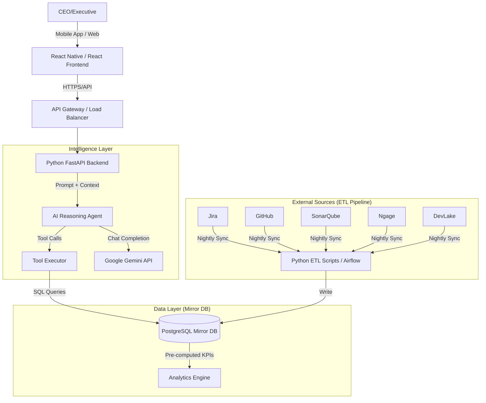

# Technical Design Document: Executive Insight Agent

## 1. Executive Summary
This document outlines the technical architecture for the **Executive Insight Agent**, an AI-powered system designed to provide CEOs and executives with instant, reasoned answers regarding project health, code quality, and team performance. The system aggregates data from Jira, GitHub, SonarQube, DevLake, Grafana, and Ngage into a unified analytical layer, processed by a reasoning engine powered by Google's Gemini API.

---

## 2. System Architecture Overview

The system follows a **Hybrid Event-Driven and Request-Response** architecture:
1.  **Batch Layer (Nightly):** Extracts, transforms, and loads (ETL) data from source systems into a centralized "Mirror Database" with pre-computed KPIs.
2.  **Serving Layer (Real-time):** A Python backend exposes APIs to the Mobile/Web frontend.
3.  **Intelligence Layer:** An AI Agent orchestrates tool calls, retrieves context from the Mirror DB, reasons using Gemini, and generates natural language responses with citations.

### High-Level Diagram

---

## 3. Core Components

### 3.1. Data Ingestion & Mirror Database (The "Brain")
To ensure sub-minute response times, we do not query external APIs live for heavy aggregations. Instead, we maintain a local mirror.

*   **Technology:** PostgreSQL (Relational DB).
*   **Schema Strategy:**
    *   **Raw Tables:** `raw_jira_issues`, `raw_github_commits`, `raw_sonar_metrics`, `raw_ngage_employee`.
    *   **Aggregated Tables (KPIs):** `daily_project_health`, `weekly_velocity`, `monthly_code_quality`, `employee_performance_summary`.
    *   **Time-Series Storage:** Optimized for 6-month rolling window data.
*   **ETL Pipeline:**
    *   **Scheduler:** Cron jobs or Apache Airflow (running nightly at 02:00 AM).
    *   **Logic:** Python scripts using `pandas` and `sqlalchemy` to fetch data via official APIs, normalize schemas, calculate KPIs (e.g., "Cycle Time", "Bug Density"), and upsert into PostgreSQL.

### 3.2. Backend API Service
*   **Technology:** Python **FastAPI**.
*   **Responsibilities:**
    *   User Authentication (JWT).
    *   Session Management (storing conversation history for context).
    *   Orchestrating the AI Agent.
    *   Serving historical charts/data to the frontend.
*   **Key Endpoints:**
    *   `POST /chat`: Send user query, receive AI response.
    *   `GET /kpi/{project_id}`: Fetch raw chart data for dashboard visualization.
    *   `GET /projects`: List accessible projects.

### 3.3. AI Reasoning Agent
*   **Model:** Google **Gemini Pro** (via free/low-cost tier API).
*   **Framework:** LangChain or custom Python orchestration.
*   **Capabilities:**
    *   **Intent Recognition:** Classify if the user wants a status update, a deep dive, or a comparison.
    *   **Tool Calling:** The agent decides which internal tools to call based on the query.
        *   *Example:* User asks "Why is Project X delayed?" -> Agent calls `get_project_risks()` and `get_recent_blockers()`.
    *   **Context Awareness:** Maintains a sliding window of the last 5-10 messages to handle follow-up questions (e.g., "What about the backend team?").
    *   **Reasoning & Citation:** Generates answers that explicitly state *why* a conclusion was reached and cites the data source (e.g., "Based on Jira ticket count increasing by 20%...").

### 3.4. Frontend Application
*   **Technology:** **React Native** (for iOS/Android Mobile) and **React.js** (for Web Dashboard).
*   **Features:**
    *   **Chat Interface:** Conversational UI similar to WhatsApp/ChatGPT.
    *   **Rich Media Cards:** Display charts, progress bars, and risk tables rendered from JSON data sent by the backend.
    *   **Voice Input:** Optional speech-to-text for hands-free querying.
    *   **Push Notifications:** Alerts for critical threshold breaches (e.g., "Critical Bug Count > 10").

---

## 4. Data Flow Design

### 4.1. Nightly Sync Flow (ETL)
1.  **Trigger:** Scheduler initiates job.
2.  **Extract:** Connectors pull data from Jira (JQL), GitHub (GraphQL), SonarQube (Web API), Ngage (HR API).
3.  **Transform:**
    *   Normalize user IDs across platforms.
    *   Calculate derived metrics (e.g., `Velocity = Completed Points / Sprint Duration`).
    *   Filter data older than 6 months (archive or delete).
4.  **Load:** Transactional update of `mirror_db`.

### 4.2. User Query Flow (Real-time)
1.  **Input:** User types/speaks: "How is the payment module doing?"
2.  **Processing:**
    *   Frontend sends payload to Backend `/chat`.
    *   Backend retrieves conversation history.
    *   **Agent Loop:**
        1.  Send prompt + history to Gemini.
        2.  Gemini returns intent + tool call request (e.g., `query_kpi(module='payment')`).
        3.  Backend executes SQL query on Mirror DB.
        4.  Backend feeds result back to Gemini.
        5.  Gemini synthesizes final natural language answer + structured data for charts.
3.  **Output:** Backend streams response to Frontend.
4.  **Render:** Frontend displays text and renders dynamic charts.

---

## 5. Technology Stack

| Component | Technology Choice | Justification |
| :--- | :--- | :--- |
| **Frontend** | React Native & React | Cross-platform mobile support, reusable web components. |
| **Backend** | Python (FastAPI) | High performance, native AI library support, async capabilities. |
| **Database** | PostgreSQL | Robust relational data, excellent for complex KPI queries. |
| **AI Model** | Google Gemini API | Cost-effective (free tier available), strong reasoning capabilities. |
| **Orchestration**| LangChain / Custom | Standardized tool-calling patterns for LLMs. |
| **Hosting** | AWS (EC2/RDS/Lambda) | Scalable, secure, fits existing infrastructure preferences. |
| **ETL** | Python + Cron/Airflow | Simple to maintain, low overhead for daily batches. |

---

## 6. Security & Compliance

*   **Data Isolation:** The Mirror DB contains only aggregated or necessary PII. Sensitive HR data from Ngage is masked unless the user has specific "HR Admin" roles.
*   **Authentication:** OAuth2 / JWT for session management.
*   **Encryption:** TLS 1.3 for data in transit; AES-256 for database at rest.
*   **Access Control:** Role-Based Access Control (RBAC) ensuring CEOs see all, while Project Managers see only their projects.

---

## 7. Implementation Phases

### Phase 1: Foundation (Weeks 1-2)
*   Setup AWS Infrastructure (VPC, EC2, RDS).
*   Design Database Schema for Mirror DB.
*   Develop ETL scripts for Jira and GitHub.
*   Build basic FastAPI skeleton.

### Phase 2: Intelligence & Integration (Weeks 3-4)
*   Integrate SonarQube and Ngage connectors.
*   Implement AI Agent logic with Gemini.
*   Develop Tool Calling mechanisms (SQL generation/validation).
*   Build Conversation History management.

### Phase 3: Frontend & Polish (Weeks 5-6)
*   Develop React Native Chat Interface.
*   Implement Chart Rendering components.
*   Testing: Unit tests for ETL, Integration tests for Agent accuracy.
*   UAT with executive stakeholders.
*   Go-Live.

---

## 8. Risk Mitigation

| Risk | Impact | Mitigation Strategy |
| :--- | :--- | :--- |
| **API Rate Limits** | High | Use nightly batching; cache results; implement exponential backoff. |
| **AI Hallucination** | Critical | Force Agent to cite specific DB rows; use "Grounding" techniques; restrict model to provided context only. |
| **Data Latency** | Medium | Clearly label data as "Updated as of [Last Night]"; allow manual "Refresh" trigger for critical metrics. |
| **Cost Overrun** | Low | Monitor Gemini API usage; set hard caps; utilize free tier limits efficiently. |

---

## 9. Conclusion
This technical design provides a robust, scalable, and cost-effective path to delivering the Executive Insight Agent. By decoupling heavy data processing (nightly ETL) from real-time interaction (AI Agent), we ensure the system meets the <1 minute response time requirement while maintaining high data accuracy and reasoning depth.
